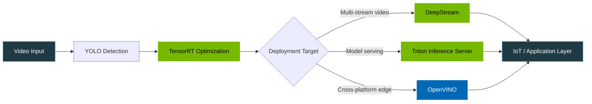

<!-- ==================== HEADER ==================== -->

 

 

<!-- ==================== ABOUT ==================== -->

##  `>` About

I work across two connected areas: **computer vision systems that run in real time on real hardware**, and **LLM chatbots and agentic pipelines**.

On the vision side, that means object detection with **YOLO**, then the part most projects skip — optimizing and deploying it. I work with **TensorRT** for accelerated inference, **DeepStream** for multi-stream video analytics, **NVIDIA Triton** for model serving, and **OpenVINO** for cross-platform deployment. Alongside this I build **IoT and embedded systems**, so detections and sensor readings feed into something that acts on them.

On the language side, I've contributed to **LLM chatbots and agentic pipelines** — systems where models coordinate tools and multi-step reasoning rather than just answering prompts.

I'm also a **published AI researcher**, with peer-reviewed conference papers spanning agricultural AI, generative AI and LLMs, and AI in healthcare.

---

<!-- ==================== STACK ==================== -->

##  Tech Stack

<table>
<tr>
<td width="50%" valign="top">

###  Computer Vision

###  Inference & Deployment

</td>
<td width="50%" valign="top">

###  LLM & Agentic Systems

###  Languages, IoT & Tools

</td>
</tr>
</table>

---

<!-- ==================== PIPELINE ==================== -->

##  Vision Deployment Stack

---

<!-- ==================== RESEARCH ==================== -->

##  Published Research

 

| Paper | Role | Venue | DOI |
| :--- | :--- | :--- | :--- |
| **Harnessing AI and Machine Learning for Early Identification and Mitigation of Crop Diseases in a Changing Agricultural Landscape** | First author | AIP Conf. Proc. 3188 (2024) | [10.1063/5.0240431](https://doi.org/10.1063/5.0240431) |
| **Unlocking the Potential of Generative AI in Large Language Models** | Co-author | Conference Paper (2024) | [ResearchGate](https://www.researchgate.net/profile/Rugved-Jalit) |
| **Artificial Intelligence in Rare Diseases: A Review of Recent Advances in Diagnosis and Treatment** | Co-author | AIP Conf. Proc. 3188 (2024) | [10.1063/5.0240432](https://doi.org/10.1063/5.0240432) |
| **Empowering Healthcare with NLP: Revolutionizing Medical Record Analysis, Patient Monitoring and Drug Discovery** | Co-author | AIP Conf. Proc. 3188 (2024) | [10.1063/5.0240706](https://doi.org/10.1063/5.0240706) |

---

<!-- ==================== PROJECTS ==================== -->

##  Featured Repositories

 

<h3> Project Breakdown</h3>

 

| Project | Description | Stack |
| :--- | :--- | :--- |
| **[AI-based Drone for Precision Agriculture](https://github.com/rugvedjalit/AI-based-Drone-for-Precision-Agriculture)** | AI drone for crop monitoring, vegetation analysis and soil mapping, using CNN for crop health assessment and Firebase for data management. | `CNN` `Firebase` `UAV` |
| **[Crop Classification using CNN](https://github.com/rugvedjalit/Deep-Learning-based-Crop-Classification-using-CNN-Architecture)** | Convolutional network classifying crop health from imagery, distinguishing healthy crops from those affected by viral or bacterial disease. | `Deep Learning` `Jupyter` |
| **[Acridinium Ester Bacterial Detection](https://github.com/rugvedjalit/Acridinium-Ester-based-Bacterial-Detection-with-Arduino)** | Arduino-based system detecting bacterial presence using Acridinium Ester chemiluminescence. | `C++` `Arduino` `Biosensing` |
| **[Linear Regression — Car Price Prediction](https://github.com/rugvedjalit/Linear-Regression)** | Predicts car prices from a US vehicle dataset using mileage, model year and brand as features. | `Regression` `Python` |
| **[Machine Learning Practice](https://github.com/rugvedjalit/Machine-Learning-Practice)** | Notebook collection of practice projects and exercises across machine learning techniques. | `Jupyter` `Python` |

---

<!-- ==================== NDA WORK ==================== -->

##  Work Not Shown Here

> A significant part of my work — real-time vision deployments, LLM and agentic systems, and IoT integrations — is **proprietary or under NDA** and can't be published. Summarised below by capability rather than by client or codebase.

<table>
<tr>
<td width="50%" valign="top">

###  Real-Time Vision Deployment
YOLO-based detection pipelines optimized with **TensorRT** and deployed through **DeepStream** for multi-stream video analytics, and **OpenVINO** for CPU/edge targets.

`YOLO` `TensorRT` `DeepStream` `OpenVINO`

</td>
<td width="50%" valign="top">

###  Model Serving at Scale
Production inference serving with **NVIDIA Triton** — multi-model hosting, versioning, and concurrent request handling behind application APIs.

`Triton` `Python` `Docker`

</td>
</tr>
<tr>
<td width="50%" valign="top">

###  LLM Chatbots & Agentic Pipelines
Conversational systems and multi-step agentic workflows where models coordinate tools, retrieval, and reasoning rather than single-turn responses.

`LLM` `Agentic Pipelines` `NLP`

</td>
<td width="50%" valign="top">

###  IoT & Embedded Integration
Sensor and microcontroller systems wired into inference pipelines, so detections and readings drive downstream actions and alerts.

`IoT` `Arduino` `C++` `Firebase`

</td>
</tr>
</table>

 Happy to discuss this work in detail — <a href="https://www.linkedin.com/in/rugved-jalit-638a35268">reach out on LinkedIn</a>

<!--
=====================================================================
 OPTIONAL: strengthen the section above with permitted metrics.
 Numbers make NDA work credible without revealing anything.
 Examples of what is usually safe to state:
   "Sustained N concurrent streams at M FPS on a single GPU"
   "Reduced inference latency by X% via TensorRT optimization"
   "Served N models concurrently through Triton"
   "Deployed across N edge devices in production"
 Only add figures you are actually permitted to share.
=====================================================================
-->

---

<!-- ==================== STATS ==================== -->

##  GitHub Analytics

 

 

---

<!-- ==================== CONNECT ==================== -->

##  Connect

Open to collaboration on **computer vision**, **edge deployment**, **LLM and agentic systems**, and **applied research**.

