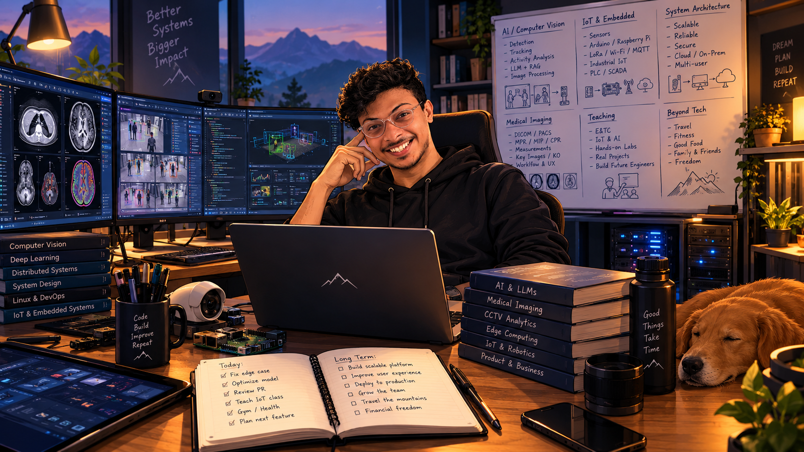
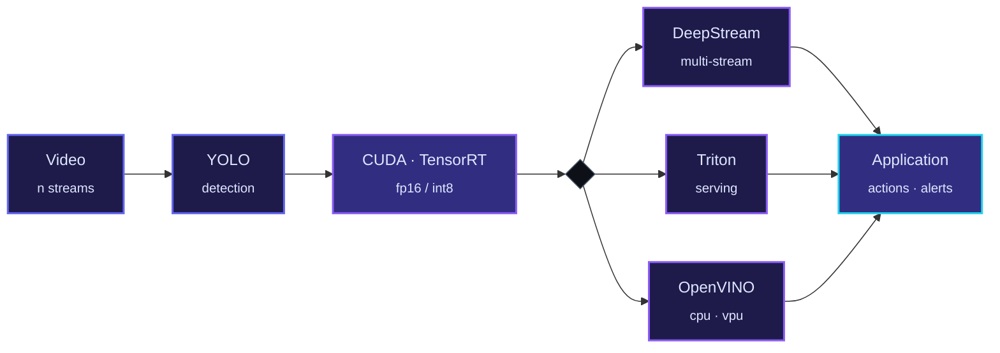

<!-- ═══════════════════════════ HERO ═══════════════════════════ -->

 

# Rugved Jalit

### Computer Vision Engineer &nbsp;·&nbsp; Edge AI &nbsp;·&nbsp; LLM Systems

 

<!-- ═══════════════════════════ INTRO ═══════════════════════════ -->

<table>
<tr>
<td width="62%" valign="top">

I work on the half of computer vision most projects never reach — **taking a trained model and making it run fast, on real hardware, on real video.**

Detection with **YOLO**, then the deployment layer that decides whether any of it ships: **CUDA** and **TensorRT** for acceleration, **DeepStream** for multi-stream analytics, **Triton** for serving, **OpenVINO** for CPU and VPU targets.

The other half is **LLM systems** — self-hosted serving with **vLLM** and **Ollama** on the **Hugging Face** ecosystem, powering chatbots and agentic pipelines that coordinate tools, retrieval and multi-step reasoning.

I deliver this work **freelance**, and publish research alongside it.

</td>
<td width="38%" valign="top">

<table>
<tr><td><b>Focus</b></td><td>Real-time vision · edge inference</td></tr>
<tr><td><b>Also</b></td><td>LLM serving · agentic pipelines</td></tr>
<tr><td><b>Hardware</b></td><td>GPU · CPU/VPU · microcontrollers</td></tr>
<tr><td><b>Research</b></td><td>4 peer-reviewed papers</td></tr>
<tr><td><b>Working</b></td><td>Freelance · open to collaboration</td></tr>
</table>

</td>
</tr>
</table>

 

<!-- ═══════════════════════════ CAPABILITIES ═══════════════════════════ -->

<h2>What I Build</h2>

<table>
<tr>
<td width="33%" valign="top">

#### Real-Time Vision
YOLO detection pipelines accelerated with CUDA and TensorRT, running multi-stream through DeepStream and on CPU/VPU via OpenVINO.

<code>YOLO</code> <code>CUDA</code> <code>TensorRT</code> <code>DeepStream</code>

</td>
<td width="33%" valign="top">

#### Model Serving
Production inference behind application APIs — Triton for vision models, vLLM for language models, with versioning and concurrent request handling.

<code>Triton</code> <code>vLLM</code> <code>Docker</code>

</td>
<td width="33%" valign="top">

#### LLM & Agents
Self-hosted models via Ollama and vLLM on the Hugging Face ecosystem, driving chatbots and multi-step agentic workflows.

<code>Ollama</code> <code>HuggingFace</code> <code>Agents</code>

</td>
</tr>
<tr>
<td valign="top">

#### Edge Deployment
Getting models onto constrained targets without losing the accuracy that made them worth deploying.

<code>OpenVINO</code> <code>TensorRT</code> <code>ONNX</code>

</td>
<td valign="top">

#### IoT & Embedded
Sensor and microcontroller systems wired into inference pipelines, so a detection becomes an action rather than a log line.

<code>Arduino</code> <code>C++</code> <code>Firebase</code>

</td>
<td valign="top">

#### Applied Research
Peer-reviewed work on agricultural AI, generative AI and LLMs, and AI in healthcare.

<code>CNN</code> <code>NLP</code> <code>Deep Learning</code>

</td>
</tr>
</table>

 

<!-- ═══════════════════════════ STACK ═══════════════════════════ -->

<h2>Stack</h2>

<table>
<tr>
<td width="20%"><b>Vision</b></td>
<td>

</td>
</tr>
<tr>
<td><b>Acceleration</b></td>
<td>

</td>
</tr>
<tr>
<td><b>Serving</b></td>
<td>

</td>
</tr>
<tr>
<td><b>Languages</b></td>
<td>

</td>
</tr>
<tr>
<td><b>Edge & IoT</b></td>
<td>

</td>
</tr>
</table>

 

<!-- ═══════════════════════════ PIPELINE ═══════════════════════════ -->

<h2>Deployment Pipeline</h2>

 

<!-- ═══════════════════════════ RESEARCH ═══════════════════════════ -->

<h2>Research</h2>

 

<table>
<tr>
<td width="70%"><a href="https://doi.org/10.1063/5.0240431"><b>Harnessing AI and Machine Learning for Early Identification and Mitigation of Crop Diseases</b></a></td>
<td width="16%"></td>
<td width="14%">AIP 3188 · 2024</td>
</tr>
<tr>
<td><a href="https://www.researchgate.net/profile/Rugved-Jalit"><b>Unlocking the Potential of Generative AI in Large Language Models</b></a></td>
<td></td>
<td>Conference · 2024</td>
</tr>
<tr>
<td><a href="https://doi.org/10.1063/5.0240432"><b>Artificial Intelligence in Rare Diseases: A Review of Recent Advances</b></a></td>
<td></td>
<td>AIP 3188 · 2024</td>
</tr>
<tr>
<td><a href="https://doi.org/10.1063/5.0240706"><b>Empowering Healthcare with NLP: Record Analysis, Monitoring & Drug Discovery</b></a></td>
<td></td>
<td>AIP 3188 · 2024</td>
</tr>
</table>

 

<!-- ═══════════════════════════ FREELANCE ═══════════════════════════ -->

<h2>Freelance & Client Work</h2>

> Delivered for clients as a freelancer. Much of it is proprietary or under NDA, so it's described by capability rather than by client, codebase or data.

<table>
<tr>
<td width="50%" valign="top">

#### Real-time vision deployment
YOLO pipelines optimized with CUDA and TensorRT, deployed through DeepStream for multi-stream analytics and OpenVINO for CPU and edge targets.

</td>
<td width="50%" valign="top">

#### Model serving
Production inference with Triton and vLLM — multi-model hosting, versioning and concurrent request handling behind application APIs.

</td>
</tr>
<tr>
<td valign="top">

#### Self-hosted LLM systems
Private model deployment with Ollama and vLLM on the Hugging Face ecosystem, powering chatbots and agentic workflows.

</td>
<td valign="top">

#### IoT & embedded integration
Sensor and microcontroller systems feeding inference pipelines and driving downstream actions and alerts.

</td>
</tr>
</table>

<!--
─────────────────────────────────────────────────────────────
 OPTIONAL — add permitted metrics above. Numbers make NDA work
 credible without revealing anything:
   "N concurrent streams at M FPS on a single GPU"
   "Reduced inference latency by X% via TensorRT"
 Only add figures you are actually allowed to share.
─────────────────────────────────────────────────────────────
-->

 

<!-- ═══════════════════════════ ACTIVITY ═══════════════════════════ -->

<h2>Activity</h2>

 

<!-- ═══════════════════════════ FOOTER ═══════════════════════════ -->

 

### Available for freelance and collaboration

Computer vision · edge deployment · LLM and agentic systems · applied research

 

  

